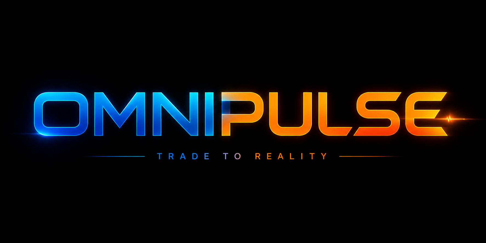

<p align="center">
  
</p>
# ⚡ O M N I • P U L S E

> The real-time probability layer on Solana  
> Micro prediction markets powered by liquidity  
> **Built for the Omnipair ecosystem**

---

##  What is OmniPulse?

OmniPulse turns uncertainty into something you can trade.

Instead of waiting days or weeks, markets now live in **minutes to hours**.

Create a question.  
Set a time.  
Trade belief.  

Watch probability move — in real time.

---

## ⚡ What's Live Right Now

The current release focuses on **experience first**  fast, visual, alive.

| Feature                                    | Status |
|-------------------------------------------|--------|
| Landing experience (hero, stats, flow)    | ✅     |
| Live market cards with real-time countdown| ✅     |
| Markets list — filterable & sortable      | ✅     |
| Create market form with instant preview   | ✅     |
| Market detail page with probability chart | ✅     |
| Mock YES/NO trading interface             | ✅     |
| Scrolling live data ticker                | ✅     |
| Animated stat counters                    | ✅     |
| Fully responsive (mobile + desktop)       | ✅     |
| Deployable on Vercel                      | ✅     |

---

## 🎯 What Comes Next

The interface becomes infrastructure.

- Wallet integration (Phantom / Backpack)  
- Solana program (Anchor)  
- YES / NO SPL token minting  
- Omnipair CPMM liquidity integration  
- Oracle-based resolution (Pyth / Switchboard)  
- Backend indexing + automation  

---

## 🧠 Why This Exists

Prediction markets have always had friction:

- Hard to create  
- Slow to resolve  
- Liquidity problems  

OmniPulse removes that.

Built on Omnipair, markets are:

> Instant. Liquid. Continuous.

---

## 🎨 Design Language

OmniPulse is not static — it moves.

- Time is always ticking  
- Prices are always shifting  
- Markets feel alive  

Even the name reflects it:

```
O M N I • P U L S E
```

A signal. A rhythm. A system in motion.

---

## ⚙️ Run Locally

```bash
npm install
npm run dev
# → http://localhost:3000
```

---

## 🚀 Deploy to Vercel

```bash
# Option A — CLI
npx vercel --prod

# Option B — GitHub
# 1. Push repo to GitHub
# 2. Import at vercel.com/new
# 3. Framework: Next.js (auto-detected)
# 4. Deploy ✅
```

---

## 📦 Push to GitHub

```bash
git init
git add .
git commit -m "feat: OmniPulse initial release"
git remote add origin https://github.com/YOUR_USERNAME/omnipulse.git
git push -u origin main
```

---

## 🧱 Project Structure

```
src/
├── app/
│   ├── page.tsx              ← Landing experience
│   ├── markets/page.tsx      ← Market feed
│   ├── market/[id]/page.tsx  ← Market detail + trading
│   └── create/page.tsx       ← Market creation
├── components/
│   ├── Navbar.tsx
│   ├── Ticker.tsx            ← Live data stream
│   ├── Countdown.tsx         ← Time as a core primitive
│   ├── MarketCard.tsx
│   ├── TradePanel.tsx        ← YES / NO interaction
│   ├── Chart.tsx             ← Probability visualization
│   ├── StatsBar.tsx          ← Animated system metrics
│   └── ShowcaseSection.tsx   ← Micro-market examples
├── hooks/useCountdown.ts
├── lib/data.ts               ← Market simulation + helpers
└── types/index.ts
```

---

## 🌍 Vision

OmniPulse is not just an interface.

It is a step toward a world where:

- Any event can become a market  
- Every market reflects real-time belief  
- Probability becomes a native layer of the internet  

---

## 🧩 Status

Early build. Rapid iteration.  
Designed to evolve into a full on-chain prediction market layer.

---

**Built for the Omnipair ecosystem**